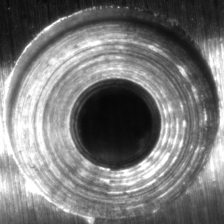
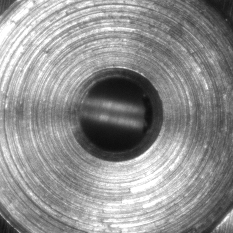
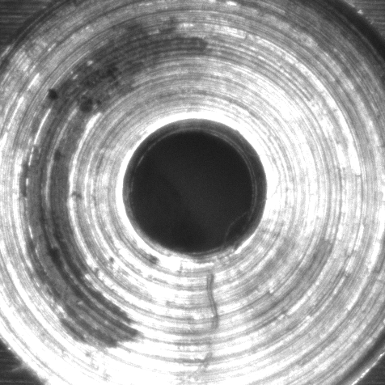

# Triplet Loss based Architecture for Anomaly Detection

## Introduction 
This project aims to develop a deep learning-based anomaly detection system for target images. This system can be integrated into a factory assembly line as an inspection tool for manufactured products. Our approach uses the combination of AutoEncoder and triplet loss to detect defective(anomalies) images.

## Data Loading and Preprocessing 
The first step in our pipeline is data loading and preprocessing. The images are labelled as OK and NG, where 'NG' represent the anomaly(defected) images. Image info, which is image path and image label is stored in 'image_path.csv'. The images in this CSV file represent the original images. After storing image info, the next part is to extract a rectangular around the circular cross-section (area of concern). Below are the examples for the same.  

<p align="center">
  
</p>

<p align="center"> Drawn rectangular box is extraced from the image and then used in the training process. </p>

#### Example of cropped images 

<p float="left">
  
   
  
</p>
For drawing rectangular boxes around circular cross section, we are using Hough Circle Algorithm

We store the image path of cropped images in 'crop_image_paths.csv'. On top of of that each cropped image is subjected to a set of augmentations. These are:

* Rotation - (0, 90, 180, 270)
* Flip - (None, Horizontal, Vertical)

Using combinations of these augmentations we get 11 augmented images from one original image. This heavy augmentaion is required because we have a very limited dataset for our intial experiment. 

## Deep Learning Architecture
<p align="center">
  
</p>

## Code Structure
### Data Loading 
To create [image_path.csv](/image_path.csv) file, run the following command from the utils directory. 
```
python3 make_image_df.py
```
Make sure that we are following this structure to store the images
```
images/
  |
  | - 20201028/
  |    |
  |    | - image_1
  |    |  
  |    | - image_2
  |      
  | - 20201207/
  |    |
  |    | - image_1
  |    |  
  |    | - image_2
  |      
  | - augmented_images/
  |  
  | - cropped_images/
 ```
### Data Processing 
To generate cropped and augmented images run the following command from the utils folder. 
```
python3 augment_crop_image.py
```
This script will add the cropped images in the images/cropped_images/ folder and generate [crop_image_paths.csv](/crop_image_paths.csv) file which is used in the traning process.

### Training Process 
To start the training, run the following command from the src directory.
```
python3 train.py --num_epochs=100 --learning_rate=0.0001 --image_df='../crop_image_paths.csv' --batch_size=64 --save_interval=50
```

#### Arguments 
* num_epochs - Number of epochs for which the model will run
* learning_rate - Set learning rate for the model
* image_df - Describe the image df path which store image patha and corresponding label
* batch_size - Set the batch size
* save_interval - Number of epcohs interval after which we save model weigths and evaluation results.
##### Model weights, training and validation loss information and evaluation results are all stored in the saved_models directory

### Report Generation
This module generates an HTML report stored in '/results/' This report displays the number of positives and negatives available in the data set, number of positives and negatives used for training, model hyperparameters, accuracy & loss curves, and the evaluated results. It also shows a sample of positives that were detected by the system and also those that were missed.

## System Requirements
This project uses Pytorch (Machine Learning Library) for writing deep learning architecture. This code can be used with or without GPU, user don't need to change anything to run the repo with GPU acceleration. It is already taken care in the code itself. 
##### Before proceedng further with setup steps make sure your system have python3 and pip3 installed.

#### Setup pip3 
For macOS and Linux
```
python3 -m pip install --user --upgrade pip
```
For windows
```
py -m pip --version
```
#### Setup Python VirtualEnv
VirtualEnv is used to manage Python packages for different projects. Using virtualenv allows you to avoid installing Python packages globally which could break system tools or other projects. You can install virtualenv using pip.
For macOS and Linux 
```
python3 -m pip install --user virtualenv
python3 -m venv env
```
For Windows:
```
py -m pip install --user virtualenv
py -m venv env
```
The second argument is the location to create the virtual environment. Generally, you can just create this in your project and call it env
#### Activate VirtualEnv
For macOs and Linux
```
source path/to/env/bin/activate
```
For Windows
```
.\env\Scripts\activate
```
#### Install the required Python Libraries
```
pip3 install -r requirement.txt
```
